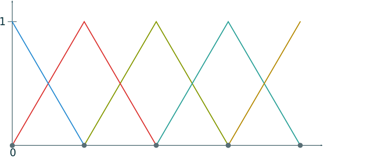

==============
Shapefunctions
==============
The shapefunctions module contains generic shapefunctions that can be used to approximate distributed systems without
giving  any information about the systems themselves. This is achieved by projecting them on generic, piecewise smooth
functions.

Shapefunction Types
-------------------

.. autoclass:: pyinduct.shapefunctions.LagrangeFirstOrder
    :members:

.. image:: ../ressources/lag2nd.svg
.. autoclass:: pyinduct.shapefunctions.LagrangeSecondOrder
    :members:

Curing an Interval
------------------
All classes contained in this module can easily be used to cure a given interval.
For example let's approximate the interval from :math:`z=0` to :math:`z=1` with 3
piecewise linear functions::

    >>> nodes, funcs = cure_interval(LagrangeFirstOrder, (0, 1), node_count=3)

The approximation nodes of the functions are chosen automatically::

    >>> list(nodes)
    [0.0, 0.5, 1.0]

.. autofunction:: pyinduct.shapefunctions.cure_interval

